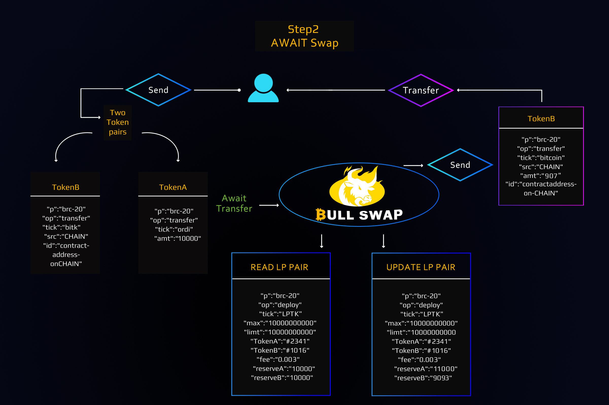
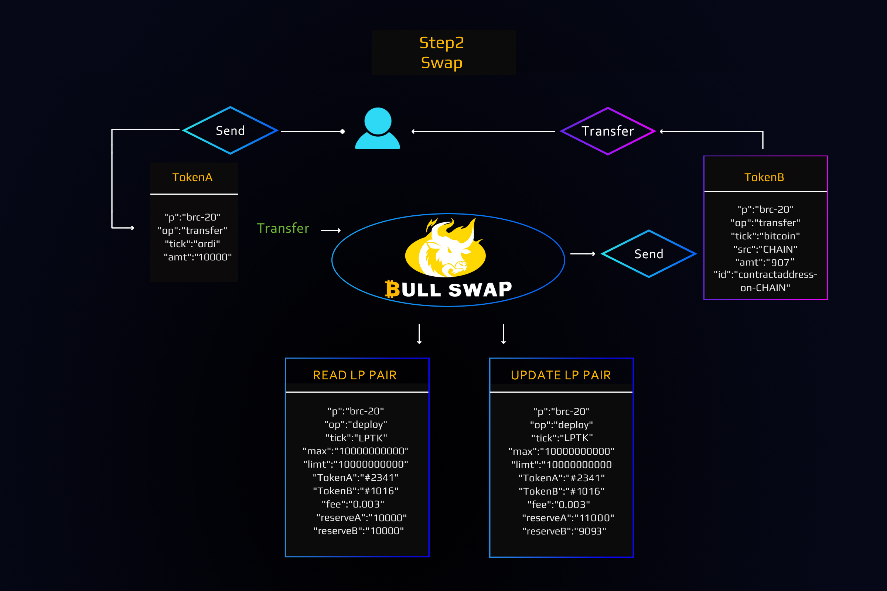
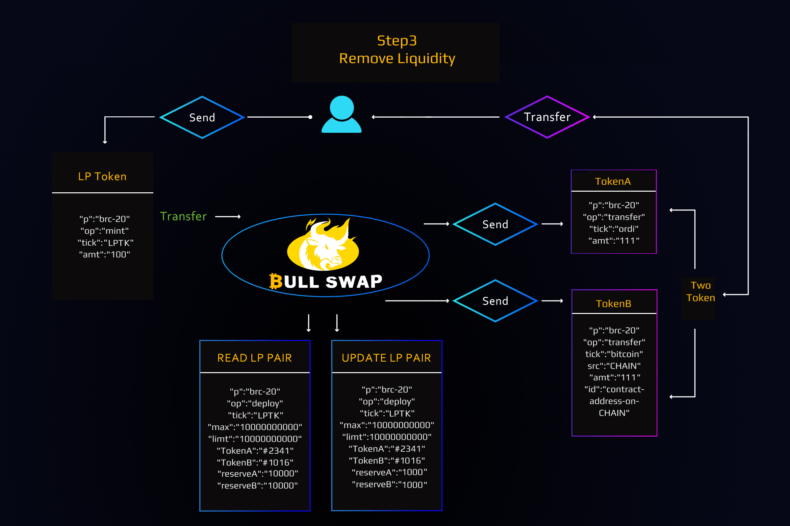

# Solution

BullSwap has built BRC20's native DEX, which is the first aggregator in the BRC20 ecosystem that combines order books and AMM functions, providing users with the most convenient trading experience and complete solutions. Liquidity providers deposit two equivalent Tokens create a market token portfolio, which can include Bitcoin with one BRC-20 token or two BRC-20 tokens, the funds in these pools are usually BTC, but this is not mandatory In return, liquidity Providers receive "liquidity tokens" that represent their share of the entire liquidity pool. These liquidity tokens can be exchanged for their share in the pool.

The BullSwap Workflow & Architect is as below:

### Add Liquidity

### Perform Token Swap

<figure><figcaption></figcaption></figure>

<figure><figcaption></figcaption></figure>

### Remove Liquidity

<figure><figcaption></figcaption></figure>

BullSwap allows users to use tokens to add Liquidity Providers (LP), thereby increasing transaction liquidity and obtaining fee incentives. This mechanism promotes real-time transactions and directly solves the liquidity problem in BRC20!
